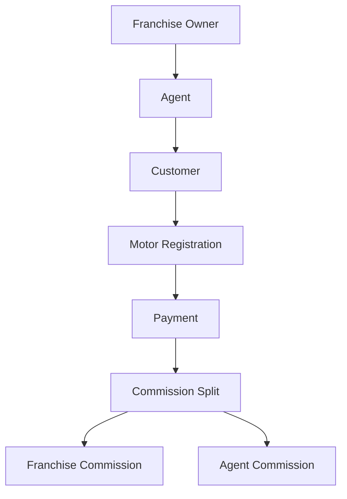

# Borumithra Mobile - Comprehensive Documentation Plan

## Document Version: 1.0
## Last Updated: January 2025

---

## Table of Contents

1. [Documentation Overview](#1-documentation-overview)
2. [Documentation Structure](#2-documentation-structure)
3. [Franchise Model Architecture](#3-franchise-model-architecture)
4. [Documentation Modules](#4-documentation-modules)
5. [Implementation Roadmap](#5-implementation-roadmap)
6. [Documentation Standards](#6-documentation-standards)

---

## 1. Documentation Overview

### 1.1 Purpose

This documentation plan outlines the comprehensive structure for the Borumithra Mobile application, including the newly introduced **Franchise Model**. The documentation aims to serve multiple audiences:

- **Developers**: Technical implementation guides, API references, and architecture diagrams
- **Franchise Owners**: Business operations, management dashboards, and revenue reporting
- **Agents**: User guides for daily operations and customer management
- **Administrators**: System configuration, user management, and analytics
- **End Users**: Customer-facing documentation for motor registration and certificate access

### 1.2 Documentation Goals

- Provide clear technical architecture and data flow documentation
- Define the franchise business model and hierarchical structure
- Create comprehensive API documentation for all services
- Establish user guides for each user role
- Document deployment and maintenance procedures
- Define data models and relationships with franchise integration

### 1.3 Target Audiences

| Audience | Documentation Focus | Priority |
|----------|-------------------|----------|
| Technical Team | Architecture, APIs, Code Structure | High |
| Franchise Owners | Business Operations, Reports, Commission | High |
| Agents | Day-to-day Operations, Customer Management | High |
| System Admins | Configuration, User Management, Analytics | High |
| Customers | Motor Registration, Payment, Certificate Access | Medium |
| Technicians | Service Management, Job Assignment | Medium |

---

## 2. Documentation Structure

### 2.1 Root Documentation Hierarchy

```
docs/
├── README.md                           # Main documentation index
├── GETTING_STARTED.md                  # Quick start guide
├── CHANGELOG.md                        # Version history and updates
│
├── 01-architecture/
│   ├── README.md
│   ├── system-architecture.md
│   ├── data-flow-diagrams.md
│   ├── security-architecture.md
│   ├── franchise-hierarchy.md          # NEW: Franchise structure
│   ├── technology-stack.md
│   └── infrastructure.md
│
├── 02-data-models/
│   ├── README.md
│   ├── agent-model.md
│   ├── customer-model.md
│   ├── technician-model.md
│   ├── motor-model.md
│   ├── payment-model.md
│   ├── franchise-model.md              # NEW: Franchise data model
│   ├── commission-model.md             # NEW: Commission/revenue model
│   ├── territory-model.md              # NEW: Territory management
│   └── relationships.md
│
├── 03-api-documentation/
│   ├── README.md
│   ├── authentication-api.md
│   ├── agent-api.md
│   ├── customer-api.md
│   ├── technician-api.md
│   ├── motor-api.md
│   ├── payment-api.md
│   ├── franchise-api.md                # NEW: Franchise APIs
│   ├── commission-api.md               # NEW: Commission APIs
│   ├── analytics-api.md                # NEW: Analytics & reporting
│   ├── firebase-functions.md
│   └── razorpay-integration.md
│
├── 04-features/
│   ├── README.md
│   ├── authentication/
│   │   ├── email-password-auth.md
│   │   ├── phone-otp-auth.md
│   │   └── session-management.md
│   ├── franchise-management/          # NEW: Franchise features
│   │   ├── franchise-registration.md
│   │   ├── franchise-dashboard.md
│   │   ├── agent-allocation.md
│   │   ├── territory-management.md
│   │   ├── commission-distribution.md
│   │   └── franchise-analytics.md
│   ├── agent-management/
│   │   ├── agent-registration.md
│   │   ├── agent-crud-operations.md
│   │   ├── agent-dashboard.md
│   │   └── agent-permissions.md
│   ├── customer-management/
│   │   ├── customer-registration.md
│   │   ├── customer-crud-operations.md
│   │   ├── motor-assignment.md
│   │   └── customer-search.md
│   ├── technician-management/
│   │   ├── technician-registration.md
│   │   ├── technician-crud-operations.md
│   │   └── service-tracking.md
│   ├── motor-registration/
│   │   ├── motor-registration-flow.md
│   │   ├── motor-certification.md
│   │   ├── pdf-generation.md
│   │   └── certificate-renewal.md
│   ├── payment-processing/
│   │   ├── razorpay-integration.md
│   │   ├── online-payment-flow.md
│   │   ├── qr-payment-flow.md
│   │   ├── payment-verification.md
│   │   └── commission-calculation.md   # NEW: Commission logic
│   ├── location-services/
│   │   ├── gps-tracking.md
│   │   └── territory-mapping.md        # NEW: Territory features
│   ├── notifications/
│   │   ├── push-notifications.md
│   │   └── fcm-integration.md
│   └── analytics-reporting/           # NEW: Analytics module
│       ├── franchise-reports.md
│       ├── agent-performance.md
│       ├── revenue-reports.md
│       └── customer-insights.md
│
├── 05-user-guides/
│   ├── README.md
│   ├── franchise-owner-guide/         # NEW: Franchise owner guide
│   │   ├── getting-started.md
│   │   ├── dashboard-overview.md
│   │   ├── managing-agents.md
│   │   ├── territory-setup.md
│   │   ├── commission-management.md
│   │   ├── reports-and-analytics.md
│   │   └── troubleshooting.md
│   ├── agent-guide/
│   │   ├── getting-started.md
│   │   ├── dashboard-overview.md
│   │   ├── customer-management.md
│   │   ├── motor-registration.md
│   │   ├── payment-processing.md
│   │   └── troubleshooting.md
│   ├── admin-guide/
│   │   ├── system-configuration.md
│   │   ├── user-management.md
│   │   ├── franchise-approval.md       # NEW: Franchise approval
│   │   ├── analytics-dashboard.md
│   │   └── system-maintenance.md
│   ├── customer-guide/
│   │   ├── registration-process.md
│   │   ├── motor-registration.md
│   │   ├── payment-guide.md
│   │   └── certificate-access.md
│   └── technician-guide/
│       ├── registration-process.md
│       ├── profile-management.md
│       └── service-workflow.md
│
├── 06-business-model/                 # NEW: Business documentation
│   ├── README.md
│   ├── franchise-business-model.md
│   ├── revenue-sharing-structure.md
│   ├── commission-tiers.md
│   ├── pricing-strategy.md
│   ├── territory-allocation.md
│   ├── onboarding-process.md
│   └── legal-compliance.md
│
├── 07-development/
│   ├── README.md
│   ├── setup-instructions.md
│   ├── environment-configuration.md
│   ├── coding-standards.md
│   ├── git-workflow.md
│   ├── testing-guidelines.md
│   ├── debugging-guide.md
│   └── contribution-guidelines.md
│
├── 08-deployment/
│   ├── README.md
│   ├── build-configuration.md
│   ├── android-deployment.md
│   ├── ios-deployment.md
│   ├── firebase-setup.md
│   ├── environment-variables.md
│   └── ci-cd-pipeline.md
│
├── 09-troubleshooting/
│   ├── README.md
│   ├── common-issues.md
│   ├── error-codes.md
│   ├── firebase-errors.md
│   ├── payment-errors.md
│   ├── franchise-issues.md             # NEW: Franchise troubleshooting
│   └── faq.md
│
└── 10-appendix/
    ├── glossary.md
    ├── references.md
    ├── api-reference-table.md
    ├── database-schema.md
    └── license.md
```

---

## 3. Franchise Model Architecture

### 3.1 Franchise Model Overview

The **Franchise Model** introduces a hierarchical business structure where franchise owners can manage multiple agents across designated territories. This creates a scalable business model with clear revenue distribution and accountability.

#### 3.1.1 Hierarchical Structure

```
Super Admin
    │
    ├── Franchise Owner 1 (Territory: State A)
    │   ├── Agent 1.1 (District: X)
    │   │   ├── Customer 1.1.1
    │   │   ├── Customer 1.1.2
    │   │   └── Technician 1.1.1
    │   ├── Agent 1.2 (District: Y)
    │   └── Agent 1.3 (District: Z)
    │
    ├── Franchise Owner 2 (Territory: State B)
    │   ├── Agent 2.1 (District: P)
    │   └── Agent 2.2 (District: Q)
    │
    └── Independent Agents (Direct to Admin)
        ├── Agent 3.1
        └── Agent 3.2
```

### 3.2 Franchise Data Model

```typescript
interface Franchise {
  // Identification
  id: string;                           // Firestore document ID
  franchiseId: string;                  // Generated ID (e.g., "BMFRNCH-KA-001")
  role: string;                         // "FRANCHISE"
  
  // Owner Information
  ownerName: string;
  ownerEmail: string;
  ownerPhone: string;
  ownerAadharNumber: string;
  ownerPanNumber: string;
  
  // Business Information
  franchiseName: string;                // Business name
  registrationNumber: string;           // Business registration
  gstNumber?: string;                   // GST number if applicable
  establishedDate: string;
  
  // Territory Assignment
  territory: {
    type: 'STATE' | 'DISTRICT' | 'MULTI_DISTRICT';
    state: string;
    districts: string[];                // Array of districts
    mandals?: string[];                 // Optional: specific mandals
    exclusiveRights: boolean;           // Exclusive territory rights
  };
  
  // Location & Contact
  location: {
    address: string;
    latitude: number;
    longitude: number;
    city: string;
    state: string;
    pincode: string;
  };
  
  officeAddress: string;
  officePhone: string;
  
  // Financial Information
  bankDetails: {
    accountNumber: string;
    ifscCode: string;
    bankName: string;
    accountHolderName: string;
    branchName: string;
  };
  
  // Commission Structure
  commissionStructure: {
    motorRegistrationCommission: number;    // Percentage (e.g., 20)
    certificateRenewalCommission: number;   // Percentage (e.g., 15)
    paymentProcessingFee: number;           // Percentage (e.g., 2)
    minimumMonthlyTarget?: number;          // Minimum revenue target
    bonusStructure?: {
      threshold: number;                    // Revenue threshold
      bonusPercentage: number;              // Additional bonus %
    }[];
  };
  
  // Agents Management
  agents: string[];                     // Array of agent IDs
  maxAgents?: number;                   // Maximum agents allowed
  activeAgentsCount: number;            // Current active agents
  
  // Statistics
  statistics: {
    totalRevenue: number;                   // Total revenue generated
    totalCommission: number;                // Total commission earned
    pendingCommission: number;              // Commission pending payout
    totalCustomers: number;                 // Total customers under franchise
    totalMotorsRegistered: number;          // Total motors registered
    totalTechnicians: number;               // Total technicians
    monthlyRevenue: {
      month: string;                        // "YYYY-MM"
      revenue: number;
      commission: number;
    }[];
  };
  
  // Status & Permissions
  isActive: boolean;
  isApproved: boolean;                  // Admin approval status
  approvedBy?: string;                  // Admin ID who approved
  approvedAt?: string;                  // Approval timestamp
  
  isSuspended: boolean;
  suspensionReason?: string;
  
  // Documents
  documents: {
    businessLicense?: string;           // Firebase Storage URL
    gstCertificate?: string;            // Firebase Storage URL
    ownerIdProof?: string;              // Firebase Storage URL
    addressProof?: string;              // Firebase Storage URL
    agreementDocument?: string;         // Franchise agreement URL
  };
  
  // Profile
  profilePhoto?: string;                // Firebase Storage URL
  logoUrl?: string;                     // Franchise business logo
  
  // Agreement & Compliance
  agreementDetails: {
    agreementDate: string;
    agreementExpiryDate: string;
    agreementDocument: string;
    termsAccepted: boolean;
    termsAcceptedAt: string;
  };
  
  // Metadata
  createdAt: string;
  updatedAt: string;
  createdBy: string;                    // Admin ID
  
  // FCM Token for notifications
  fcmToken?: string;
  
  // Notes
  adminNotes?: string;
}
```

### 3.3 Commission Model

```typescript
interface CommissionTransaction {
  // Identification
  id: string;                           // Firestore document ID
  transactionId: string;                // Unique transaction ID
  
  // References
  franchiseId: string;                  // Franchise ID
  franchiseIdRef: string;               // Franchise document ID
  agentId: string;                      // Agent ID
  agentIdRef: string;                   // Agent document ID
  customerId?: string;                  // Customer ID
  motorId?: string;                     // Motor ID
  paymentId: string;                    // Original payment ID
  
  // Transaction Details
  transactionType: 'MOTOR_REGISTRATION' | 'CERTIFICATE_RENEWAL' | 'PAYMENT_PROCESSING';
  totalAmount: number;                  // Total payment amount
  commissionPercentage: number;         // Commission % applied
  commissionAmount: number;             // Commission earned
  
  // Split Details
  splits: {
    franchiseCommission: number;        // Franchise share
    agentCommission: number;            // Agent share
    adminShare: number;                 // Admin/platform share
    taxDeducted?: number;               // TDS if applicable
  };
  
  // Status
  status: 'PENDING' | 'PROCESSED' | 'PAID' | 'FAILED' | 'DISPUTED';
  
  // Payout Information
  payoutDetails?: {
    payoutDate?: string;
    payoutMethod?: 'BANK_TRANSFER' | 'UPI' | 'WALLET';
    payoutReference?: string;
    utrNumber?: string;
  };
  
  // Metadata
  createdAt: string;
  processedAt?: string;
  paidAt?: string;
  
  // Notes
  notes?: string;
  disputeReason?: string;
}
```

### 3.4 Territory Model

```typescript
interface Territory {
  // Identification
  id: string;
  territoryId: string;                  // e.g., "BMTER-KA-BGP"
  
  // Location
  state: string;
  district: string;
  mandals?: string[];
  villages?: string[];
  pincodes?: string[];
  
  // Boundaries (for mapping)
  boundaries?: {
    type: 'Polygon';
    coordinates: [number, number][];    // [longitude, latitude]
  };
  
  // Assignment
  franchiseId?: string;                 // Assigned franchise ID
  franchiseIdRef?: string;              // Franchise document ID
  assignmentType: 'EXCLUSIVE' | 'SHARED' | 'UNASSIGNED';
  
  // Status
  isActive: boolean;
  assignedAt?: string;
  
  // Statistics
  populationEstimate?: number;
  potentialCustomers?: number;
  activeCustomers: number;
  activeAgents: number;
  
  // Metadata
  createdAt: string;
  updatedAt: string;
}
```

### 3.5 Updated Agent Model (with Franchise Integration)

```typescript
interface Agent {
  // ... (existing fields)
  
  // NEW: Franchise Integration
  franchiseId?: string;                 // Franchise ID (if under franchise)
  franchiseIdRef?: string;              // Franchise document ID
  isFranchiseAgent: boolean;            // Flag for franchise agents
  
  // NEW: Commission Settings (for franchise agents)
  commissionSettings?: {
    motorRegistrationShare: number;     // Agent's share percentage
    certificateRenewalShare: number;    // Agent's share percentage
  };
  
  // NEW: Performance Metrics
  performanceMetrics?: {
    monthlyTarget?: number;
    currentMonthRevenue: number;
    totalRevenue: number;
    totalCommission: number;
    rating?: number;                    // Performance rating
  };
}
```

### 3.6 Key Features of Franchise Model

#### 3.6.1 Franchise Registration & Onboarding

**Process Flow:**
1. Franchise owner fills registration form
2. Upload required documents (business license, ID proofs, etc.)
3. Select territory preferences
4. Admin reviews and approves/rejects
5. Sign digital franchise agreement
6. Setup commission structure
7. Activate franchise account
8. Onboard first set of agents

**Key Documents:**
- Business Registration Certificate
- GST Certificate (if applicable)
- Owner Identity Proof (Aadhar, PAN)
- Address Proof
- Bank Account Details
- Franchise Agreement (digitally signed)

#### 3.6.2 Territory Management

**Features:**
- Interactive map view of territories
- Territory assignment to franchises
- Exclusive vs. shared territory options
- District/Mandal level granularity
- Territory performance analytics
- Overlap detection and resolution

#### 3.6.3 Agent Allocation

**Franchise Owner Can:**
- Add new agents under their franchise
- View all agents in their territory
- Monitor agent performance
- Set agent-specific targets
- Approve/suspend agents
- Transfer agents between territories

**Constraints:**
- Maximum agent limit per franchise
- Agents must operate within franchise territory
- Agent performance affects franchise rating

#### 3.6.4 Commission Distribution

**Commission Flow:**
```
Customer Payment (₹1000)
    │
    ├─> Platform Fee (10%) = ₹100
    │
    ├─> Franchise Commission (20%) = ₹200
    │
    └─> Agent Commission (70%) = ₹700
```

**Commission Tiers:**

| Tier | Monthly Revenue | Franchise Commission | Agent Commission |
|------|----------------|---------------------|------------------|
| Bronze | ₹0 - ₹50,000 | 15% | 75% |
| Silver | ₹50,001 - ₹1,00,000 | 20% | 70% |
| Gold | ₹1,00,001 - ₹2,50,000 | 25% | 65% |
| Platinum | ₹2,50,001+ | 30% | 60% |

*Platform fee: 10% deducted from total before split*

**Payout Schedule:**
- Monthly commission payout (1st of every month)
- Minimum payout threshold: ₹1,000
- Payment methods: Bank transfer, UPI
- Auto-calculation based on previous month revenue

#### 3.6.5 Franchise Dashboard

**Key Metrics:**
- Total agents under franchise
- Active customers count
- Total motors registered
- Monthly/yearly revenue
- Commission earned vs. pending
- Territory coverage map
- Top performing agents
- Recent transactions
- Pending approvals

**Analytics:**
- Revenue trends (daily, weekly, monthly)
- Agent performance comparison
- Customer acquisition rate
- Motor registration trends by type
- Payment method distribution
- Territory-wise breakdown
- Commission payout history

#### 3.6.6 Franchise Reports

**Available Reports:**
1. **Revenue Report**
   - Date range selector
   - Revenue by agent
   - Revenue by motor type
   - Payment method breakdown
   - Export to PDF/Excel

2. **Commission Report**
   - Earned vs. pending commission
   - Agent-wise commission split
   - Payout history
   - Tax deductions (TDS)

3. **Agent Performance Report**
   - Customer acquisition rate
   - Motor registration count
   - Average transaction value
   - Performance rating

4. **Customer Insights Report**
   - New vs. repeat customers
   - Customer distribution by area
   - Motor type preferences
   - Payment behavior

5. **Territory Coverage Report**
   - Area-wise penetration
   - Untapped areas
   - Competitor analysis
   - Expansion opportunities

#### 3.6.7 Franchise Owner Permissions

| Permission | Franchise Owner | Agent | Admin |
|-----------|----------------|-------|-------|
| View franchise dashboard | ✅ | ❌ | ✅ |
| Add/Edit agents | ✅ | ❌ | ✅ |
| View all agents | ✅ | ❌ (only self) | ✅ |
| Approve agents | ✅ | ❌ | ✅ |
| View commission reports | ✅ | ❌ (only self) | ✅ |
| Edit commission structure | ❌ | ❌ | ✅ |
| View franchise revenue | ✅ | ❌ | ✅ |
| View agent revenue | ✅ | ❌ (only self) | ✅ |
| Manage territory | ❌ | ❌ | ✅ |
| View customers | ✅ | ✅ (own only) | ✅ |
| Register motors | ❌ | ✅ | ✅ |
| Process payments | ❌ | ✅ | ✅ |

---

## 4. Documentation Modules

### 4.1 Architecture Documentation

#### 4.1.1 System Architecture (`01-architecture/system-architecture.md`)

**Content:**
- High-level system architecture diagram
- Component breakdown
- Service interactions
- Database architecture
- Cloud infrastructure
- Franchise module integration

#### 4.1.2 Franchise Hierarchy (`01-architecture/franchise-hierarchy.md`)

**Content:**
- Franchise organizational structure
- Role-based hierarchy diagram
- Permission flow
- Data access patterns
- Territory-based segregation
- Multi-tenancy architecture

#### 4.1.3 Data Flow Diagrams (`01-architecture/data-flow-diagrams.md`)

**Content:**
- User authentication flow
- Franchise registration flow
- Agent onboarding under franchise
- Customer registration flow
- Motor registration flow
- Payment processing flow (with commission split)
- Commission calculation flow
- Territory assignment flow
- Report generation flow

#### 4.1.4 Security Architecture (`01-architecture/security-architecture.md`)

**Content:**
- Firebase Security Rules
- Authentication & authorization
- Role-based access control (RBAC)
- Franchise-agent isolation
- Data encryption
- API security
- Payment security (PCI compliance)
- Document storage security

### 4.2 Data Models Documentation

#### 4.2.1 Franchise Model (`02-data-models/franchise-model.md`)

**Content:**
- Complete franchise interface definition
- Field descriptions
- Validation rules
- Relationships with other models
- Sample data
- Firestore collection structure

#### 4.2.2 Commission Model (`02-data-models/commission-model.md`)

**Content:**
- Commission transaction structure
- Split calculation logic
- Commission tiers documentation
- Payout workflow
- TDS/tax handling
- Sample calculations

#### 4.2.3 Territory Model (`02-data-models/territory-model.md`)

**Content:**
- Territory data structure
- Boundary definitions
- Assignment rules
- Territory analytics
- Mapping integration

#### 4.2.4 Relationships (`02-data-models/relationships.md`)

**Content:**
- Entity relationship diagram (ERD)
- Franchise → Agent → Customer → Motor relationship
- Commission → Payment → Motor relationship
- Territory → Franchise relationship
- Foreign key references
- Data integrity constraints

### 4.3 API Documentation

#### 4.3.1 Franchise API (`03-api-documentation/franchise-api.md`)

**Endpoints:**

```typescript
// Franchise Registration
POST /api/franchise/register
Body: FranchiseRegistrationData
Response: { franchiseId, status, message }

// Get Franchise Details
GET /api/franchise/:franchiseId
Response: Franchise

// Update Franchise
PUT /api/franchise/:franchiseId
Body: Partial<Franchise>
Response: { success, franchise }

// Get Franchise Dashboard Data
GET /api/franchise/:franchiseId/dashboard
Response: DashboardData

// Get Franchise Agents
GET /api/franchise/:franchiseId/agents
Query: { page, limit, status, district }
Response: { agents: Agent[], total, page }

// Add Agent to Franchise
POST /api/franchise/:franchiseId/agents
Body: AgentData
Response: { agentId, status }

// Get Franchise Statistics
GET /api/franchise/:franchiseId/statistics
Query: { startDate, endDate }
Response: FranchiseStatistics

// Approve/Reject Franchise (Admin only)
POST /api/admin/franchise/:franchiseId/approve
Body: { approved: boolean, notes }
Response: { success, message }
```

#### 4.3.2 Commission API (`03-api-documentation/commission-api.md`)

**Endpoints:**

```typescript
// Get Commission History
GET /api/commission/franchise/:franchiseId
Query: { startDate, endDate, status, page, limit }
Response: { commissions: CommissionTransaction[], total }

// Get Pending Commission
GET /api/commission/franchise/:franchiseId/pending
Response: { totalPending, transactions: CommissionTransaction[] }

// Process Commission Payout
POST /api/commission/payout/:commissionId
Body: { payoutMethod, utrNumber }
Response: { success, message, payout }

// Get Commission Report
GET /api/commission/franchise/:franchiseId/report
Query: { month, year, format: 'json' | 'pdf' | 'excel' }
Response: CommissionReport | File
```

#### 4.3.3 Analytics API (`03-api-documentation/analytics-api.md`)

**Endpoints:**

```typescript
// Franchise Analytics Dashboard
GET /api/analytics/franchise/:franchiseId/dashboard
Response: {
  revenue: { current, previous, growth },
  agents: { total, active, inactive },
  customers: { total, newThisMonth },
  motors: { total, thisMonth },
  topAgents: AgentPerformance[],
  revenueChart: ChartData
}

// Territory Performance
GET /api/analytics/territory/:territoryId
Response: TerritoryAnalytics

// Agent Performance Report
GET /api/analytics/franchise/:franchiseId/agents/performance
Query: { agentId, startDate, endDate }
Response: AgentPerformanceReport

// Revenue Trends
GET /api/analytics/franchise/:franchiseId/revenue/trends
Query: { period: 'daily' | 'weekly' | 'monthly', startDate, endDate }
Response: RevenueTrendData
```

### 4.4 Feature Documentation

#### 4.4.1 Franchise Management Features

**Documents to Create:**

1. **Franchise Registration** (`04-features/franchise-management/franchise-registration.md`)
   - Registration form fields
   - Document upload requirements
   - Validation rules
   - Approval workflow
   - Post-approval setup

2. **Franchise Dashboard** (`04-features/franchise-management/franchise-dashboard.md`)
   - Dashboard components
   - Metrics displayed
   - Real-time updates
   - Interactive charts
   - Quick actions

3. **Agent Allocation** (`04-features/franchise-management/agent-allocation.md`)
   - Adding agents to franchise
   - Agent approval process
   - Territory assignment
   - Agent transfer process
   - Agent performance monitoring

4. **Territory Management** (`04-features/franchise-management/territory-management.md`)
   - Territory creation
   - Boundary definition
   - Assignment rules
   - Exclusive vs. shared territories
   - Territory analytics

5. **Commission Distribution** (`04-features/franchise-management/commission-distribution.md`)
   - Commission calculation logic
   - Split percentages
   - Tier system
   - Payout schedule
   - Tax handling

6. **Franchise Analytics** (`04-features/franchise-management/franchise-analytics.md`)
   - Available reports
   - Report generation
   - Data filters
   - Export options
   - Scheduled reports

### 4.5 User Guides

#### 4.5.1 Franchise Owner Guide

**Comprehensive Guide Structure:**

1. **Getting Started** (`05-user-guides/franchise-owner-guide/getting-started.md`)
   - Registration process
   - Account verification
   - Initial setup wizard
   - Document submission
   - First login experience

2. **Dashboard Overview** (`05-user-guides/franchise-owner-guide/dashboard-overview.md`)
   - Dashboard layout
   - Key metrics explanation
   - Navigation menu
   - Notification center
   - Quick actions

3. **Managing Agents** (`05-user-guides/franchise-owner-guide/managing-agents.md`)
   - Adding new agents
   - Viewing agent list
   - Agent profile details
   - Approving agents
   - Suspending agents
   - Agent performance review
   - Setting agent targets

4. **Territory Setup** (`05-user-guides/franchise-owner-guide/territory-setup.md`)
   - Understanding territories
   - Viewing assigned territory
   - Territory coverage map
   - Expanding territory
   - Territory analytics

5. **Commission Management** (`05-user-guides/franchise-owner-guide/commission-management.md`)
   - Understanding commission structure
   - Viewing earned commission
   - Commission tiers
   - Payout schedule
   - Commission history
   - Tax information

6. **Reports and Analytics** (`05-user-guides/franchise-owner-guide/reports-and-analytics.md`)
   - Revenue reports
   - Commission reports
   - Agent performance reports
   - Customer insights
   - Generating reports
   - Exporting data
   - Scheduling reports

7. **Troubleshooting** (`05-user-guides/franchise-owner-guide/troubleshooting.md`)
   - Common issues
   - Login problems
   - Commission disputes
   - Agent management issues
   - Contact support

### 4.6 Business Model Documentation

#### 4.6.1 Franchise Business Model (`06-business-model/franchise-business-model.md`)

**Content:**
- Business overview
- Value proposition
- Target market
- Franchise benefits
- Investment requirements
- Revenue potential
- Growth strategy
- Success stories

#### 4.6.2 Revenue Sharing Structure (`06-business-model/revenue-sharing-structure.md`)

**Content:**
- Revenue split breakdown
- Commission calculation examples
- Tier system explained
- Bonus structure
- Payout schedule
- Payment methods
- Tax implications

#### 4.6.3 Commission Tiers (`06-business-model/commission-tiers.md`)

**Content:**
- Tier definitions
- Qualification criteria
- Benefits per tier
- Upgrade path
- Performance requirements
- Tier comparison table

#### 4.6.4 Pricing Strategy (`06-business-model/pricing-strategy.md`)

**Content:**
- Motor registration pricing
- Service fees
- Renewal charges
- Bulk pricing
- Seasonal discounts
- Coupon system

#### 4.6.5 Territory Allocation (`06-business-model/territory-allocation.md`)

**Content:**
- Territory assignment criteria
- Exclusive vs. shared territories
- Territory expansion rules
- Performance-based expansion
- Territory boundaries
- Conflict resolution

#### 4.6.6 Onboarding Process (`06-business-model/onboarding-process.md`)

**Content:**
- Step-by-step onboarding
- Documentation checklist
- Training program
- Initial setup
- Support during onboarding
- Timeline expectations

#### 4.6.7 Legal & Compliance (`06-business-model/legal-compliance.md`)

**Content:**
- Franchise agreement terms
- Legal obligations
- Compliance requirements
- Tax responsibilities
- Data protection
- Dispute resolution
- Termination clauses

---

## 5. Implementation Roadmap

### 5.1 Phase 1: Core Documentation (Weeks 1-2)

**Priority: HIGH**

- [ ] Create documentation structure (folders and README files)
- [ ] Document existing features:
  - [ ] Authentication (Email, Phone OTP)
  - [ ] Agent Management
  - [ ] Customer Management
  - [ ] Motor Registration
  - [ ] Payment Processing
  - [ ] Certificate Generation
- [ ] Document current data models
- [ ] Document current API endpoints
- [ ] Create architecture diagrams
- [ ] Set up documentation repository

**Deliverables:**
- Basic documentation structure
- Existing feature documentation
- Current architecture diagrams

### 5.2 Phase 2: Franchise Model Design (Weeks 3-4)

**Priority: HIGH**

- [ ] Define franchise data model
- [ ] Design commission model
- [ ] Design territory model
- [ ] Create franchise hierarchy diagrams
- [ ] Document commission calculation logic
- [ ] Define franchise API specifications
- [ ] Create franchise user flow diagrams
- [ ] Design franchise dashboard wireframes

**Deliverables:**
- Franchise data models
- API specifications
- User flow diagrams
- Dashboard wireframes

### 5.3 Phase 3: API & Integration Documentation (Weeks 5-6)

**Priority: HIGH**

- [ ] Document Franchise APIs
- [ ] Document Commission APIs
- [ ] Document Analytics APIs
- [ ] Update existing APIs with franchise integration
- [ ] Create API request/response examples
- [ ] Document Firebase Security Rules updates
- [ ] Document payment flow with commission split
- [ ] Create integration guides

**Deliverables:**
- Complete API documentation
- Integration guides
- Security rules documentation

### 5.4 Phase 4: User Guides & Business Documentation (Weeks 7-8)

**Priority: MEDIUM**

- [ ] Write Franchise Owner Guide
  - [ ] Getting Started
  - [ ] Dashboard Overview
  - [ ] Managing Agents
  - [ ] Territory Management
  - [ ] Commission Management
  - [ ] Reports & Analytics
  - [ ] Troubleshooting
- [ ] Update Agent Guide with franchise context
- [ ] Write Business Model Documentation
  - [ ] Franchise Business Model
  - [ ] Revenue Sharing Structure
  - [ ] Commission Tiers
  - [ ] Pricing Strategy
  - [ ] Territory Allocation
  - [ ] Onboarding Process
  - [ ] Legal & Compliance
- [ ] Create training materials
- [ ] Create FAQ documents

**Deliverables:**
- User guides for all roles
- Business documentation
- Training materials
- FAQ documents

### 5.5 Phase 5: Development Documentation (Weeks 9-10)

**Priority: MEDIUM**

- [ ] Update setup instructions with franchise features
- [ ] Document new Redux slices (franchise, commission)
- [ ] Document new screens and components
- [ ] Update testing guidelines
- [ ] Create database migration guides
- [ ] Document environment variables
- [ ] Create deployment guides with franchise setup

**Deliverables:**
- Development setup guide
- Component documentation
- Testing guidelines
- Deployment guide

### 5.6 Phase 6: Polish & Review (Weeks 11-12)

**Priority: LOW**

- [ ] Review all documentation for accuracy
- [ ] Add screenshots and diagrams
- [ ] Create video tutorials
- [ ] Set up documentation website (e.g., GitBook, Docusaurus)
- [ ] Add search functionality
- [ ] Create documentation index
- [ ] Get stakeholder feedback
- [ ] Make revisions based on feedback

**Deliverables:**
- Polished documentation
- Documentation website
- Video tutorials
- Final review and sign-off

---

## 6. Documentation Standards

### 6.1 Writing Guidelines

#### 6.1.1 Style Guide

- **Language**: Clear, concise, professional English
- **Tone**: Informative and helpful
- **Voice**: Active voice preferred
- **Tense**: Present tense for current features
- **Audience**: Write for the target audience (technical vs. business)

#### 6.1.2 Formatting Standards

**Headers:**
```markdown
# H1 - Document Title (once per document)
## H2 - Major Sections
### H3 - Subsections
#### H4 - Minor Subsections
```

**Code Blocks:**
```typescript
// Always specify language for syntax highlighting
interface Example {
  field: string;
}
```

**Lists:**
- Use bullet points for unordered lists
- Use numbered lists for sequential steps
- Indent nested lists consistently

**Tables:**
| Column 1 | Column 2 | Column 3 |
|----------|----------|----------|
| Data 1   | Data 2   | Data 3   |

**Links:**
- Use descriptive link text
- Prefer relative links for internal documentation
- Example: `[Franchise Model](./franchise-model.md)`

**Images:**
```markdown

*Figure 1: Description of the image*
```

#### 6.1.3 Code Examples

**Requirements:**
- Include complete, runnable code examples
- Add comments to explain complex logic
- Show both request and response for API examples
- Include error handling examples

**Example:**
```typescript
// Register a new franchise
const registerFranchise = async (franchiseData: FranchiseRegistrationData) => {
  try {
    const response = await franchiseApi.register(franchiseData);
    return {
      success: true,
      franchiseId: response.franchiseId,
      message: 'Franchise registered successfully',
    };
  } catch (error) {
    console.error('Franchise registration failed:', error);
    return {
      success: false,
      error: error.message,
    };
  }
};
```

### 6.2 Diagram Standards

#### 6.2.1 Architecture Diagrams

**Tools:**
- Draw.io / Lucidchart for architecture diagrams
- Mermaid for flowcharts (embedded in markdown)
- Figma for UI mockups

**Requirements:**
- Use consistent colors and shapes
- Include legend
- Label all components
- Show data flow direction
- Keep diagrams clean and readable

**Example (Mermaid):**


#### 6.2.2 Flowcharts

**Requirements:**
- Start with clear entry point
- Show all decision points
- Include error paths
- End with clear outcome
- Use standard flowchart symbols

### 6.3 API Documentation Standards

#### 6.3.1 Endpoint Documentation Format

```markdown
### Endpoint Name

**Method**: GET/POST/PUT/DELETE  
**Path**: `/api/resource/:id`  
**Authentication**: Required/Optional  
**Permissions**: franchise_owner, admin

**Description:**
Brief description of what this endpoint does.

**Path Parameters:**
| Parameter | Type | Required | Description |
|-----------|------|----------|-------------|
| id | string | Yes | Resource ID |

**Query Parameters:**
| Parameter | Type | Required | Default | Description |
|-----------|------|----------|---------|-------------|
| page | number | No | 1 | Page number |
| limit | number | No | 10 | Items per page |

**Request Body:**
```json
{
  "field1": "value1",
  "field2": "value2"
}
```

**Success Response:**
- **Code**: 200 OK
- **Content:**
```json
{
  "success": true,
  "data": { ... }
}
```

**Error Response:**
- **Code**: 400 Bad Request
- **Content:**
```json
{
  "success": false,
  "error": "Error message"
}
```

**Example:**
```typescript
const response = await fetch('/api/franchise/123', {
  headers: {
    'Authorization': 'Bearer token',
  },
});
```
```

### 6.4 Version Control for Documentation

#### 6.4.1 Versioning Strategy

- Use semantic versioning for documentation (e.g., v1.0.0)
- Major version: Significant structural changes
- Minor version: New features added
- Patch version: Corrections and clarifications

#### 6.4.2 Change Log

Maintain a `CHANGELOG.md` file:

```markdown
# Documentation Changelog

## [2.0.0] - 2025-01-15

### Added
- Franchise model documentation
- Commission structure documentation
- Territory management documentation

### Changed
- Updated agent model with franchise integration
- Updated payment flow with commission split

### Fixed
- Corrected API endpoint examples
```

### 6.5 Documentation Review Process

#### 6.5.1 Review Checklist

- [ ] Accuracy: Information is correct and up-to-date
- [ ] Completeness: All required sections are present
- [ ] Clarity: Easy to understand for target audience
- [ ] Consistency: Follows documentation standards
- [ ] Code examples: Tested and functional
- [ ] Links: All internal and external links work
- [ ] Formatting: Proper markdown formatting
- [ ] Diagrams: Clear and properly labeled
- [ ] Grammar: No spelling or grammatical errors

#### 6.5.2 Review Process

1. **Author**: Creates initial documentation
2. **Peer Review**: Technical review by team member
3. **Stakeholder Review**: Business review by product owner
4. **Approval**: Final approval by documentation lead
5. **Publication**: Merge to main documentation branch

### 6.6 Documentation Maintenance

#### 6.6.1 Regular Updates

- **Quarterly Review**: Review and update all documentation
- **Feature Updates**: Update docs with each new feature release
- **Bug Fixes**: Update docs when bugs affect documented behavior
- **User Feedback**: Incorporate user feedback and FAQs

#### 6.6.2 Deprecation Notices

When features are deprecated:
```markdown
> **⚠️ DEPRECATED**  
> This feature is deprecated as of v2.0.0 and will be removed in v3.0.0.  
> Use [NewFeature](./new-feature.md) instead.
```

---

## 7. Documentation Tools & Resources

### 7.1 Recommended Tools

#### 7.1.1 Documentation Platforms

1. **GitBook** (Recommended)
   - Pros: Beautiful UI, version control, search, collaboration
   - Use case: Public documentation
   
2. **Docusaurus** (Alternative)
   - Pros: Open-source, customizable, React-based
   - Use case: Developer documentation

3. **Markdown + GitHub Pages**
   - Pros: Simple, free, version controlled
   - Use case: Technical documentation

#### 7.1.2 Diagramming Tools

1. **Draw.io** - Architecture diagrams
2. **Mermaid** - Flowcharts in markdown
3. **Lucidchart** - Professional diagrams
4. **Figma** - UI mockups and wireframes
5. **PlantUML** - UML diagrams from text

#### 7.1.3 Code Documentation

1. **TypeDoc** - TypeScript documentation generator
2. **JSDoc** - JavaScript documentation
3. **Swagger/OpenAPI** - API documentation
4. **Postman** - API testing and documentation

### 7.2 Templates

#### 7.2.1 Feature Documentation Template

```markdown
# Feature Name

## Overview
Brief description of the feature.

## User Story
As a [user type], I want to [action] so that [benefit].

## Requirements
- Requirement 1
- Requirement 2

## Data Model
```typescript
interface Model {
  field: string;
}
```

## User Interface
- Screenshots
- Wireframes
- User flow

## API Endpoints
List of related API endpoints

## Implementation Details
Technical implementation notes

## Testing
- Test scenarios
- Test cases

## Security Considerations
Security aspects to consider

## Future Enhancements
Potential improvements
```

#### 7.2.2 API Endpoint Template

(See section 6.3.1)

#### 7.2.3 User Guide Template

```markdown
# [Feature] - User Guide

## Introduction
What this guide covers

## Prerequisites
What users need before starting

## Step-by-Step Instructions

### Step 1: [Action]
1. First sub-step
2. Second sub-step

**Screenshot:**


### Step 2: [Action]
...

## Tips and Best Practices
- Tip 1
- Tip 2

## Common Issues
| Issue | Solution |
|-------|----------|
| Issue 1 | Solution 1 |

## Related Guides
- [Related Guide 1](./guide1.md)
- [Related Guide 2](./guide2.md)
```

---

## 8. Success Metrics

### 8.1 Documentation Quality Metrics

- **Completeness**: 100% feature coverage
- **Accuracy**: < 5% error rate in code examples
- **Clarity**: User feedback rating > 4/5
- **Up-to-date**: < 2 weeks lag from code updates
- **Search effectiveness**: Users find info within 3 clicks

### 8.2 Usage Metrics

- **Page views**: Track most/least viewed pages
- **Search queries**: Identify gaps in documentation
- **Feedback**: Collect user ratings and comments
- **Support tickets**: Reduce tickets by 30% with good docs

### 8.3 KPIs for Documentation

| KPI | Target | Measurement |
|-----|--------|-------------|
| Documentation coverage | 100% | Features documented / Total features |
| Time to find information | < 2 min | User testing |
| Documentation errors | < 2% | Error reports / Total pages |
| User satisfaction | > 4/5 | Survey ratings |
| Support ticket reduction | 30% | Before vs. after comparison |

---

## 9. Appendices

### 9.1 Glossary

| Term | Definition |
|------|------------|
| Franchise | A business entity that manages multiple agents in a territory |
| Franchise Owner | Person who owns and operates a franchise |
| Territory | Geographic area assigned to a franchise |
| Commission | Percentage of payment shared with franchise/agent |
| Agent | Field representative who registers customers |
| Motor Registration | Process of certifying a water motor |
| Certificate | Official document issued after motor registration |

### 9.2 Acronyms

| Acronym | Full Form |
|---------|-----------|
| API | Application Programming Interface |
| CRUD | Create, Read, Update, Delete |
| FCM | Firebase Cloud Messaging |
| GPS | Global Positioning System |
| GST | Goods and Services Tax |
| KPI | Key Performance Indicator |
| OTP | One-Time Password |
| PAN | Permanent Account Number |
| PDF | Portable Document Format |
| RBAC | Role-Based Access Control |
| TDS | Tax Deducted at Source |
| UI | User Interface |
| UPI | Unified Payments Interface |
| UTR | Unique Transaction Reference |

### 9.3 References

- Firebase Documentation: https://firebase.google.com/docs
- React Native Documentation: https://reactnative.dev/docs
- Razorpay API Documentation: https://razorpay.com/docs/api/
- TypeScript Documentation: https://www.typescriptlang.org/docs/
- Redux Toolkit Documentation: https://redux-toolkit.js.org/

---

## 10. Contact & Support

### 10.1 Documentation Team

- **Documentation Lead**: [Name]
- **Technical Writer**: [Name]
- **Technical Reviewer**: [Name]

### 10.2 Feedback

For documentation feedback or suggestions:
- **Email**: docs@borumithra.com
- **Slack Channel**: #documentation
- **GitHub Issues**: [Repository URL]/issues

---

## Document Change History

| Version | Date | Author | Changes |
|---------|------|--------|---------|
| 1.0 | 2025-01-03 | Documentation Team | Initial documentation plan with franchise model |

---

**END OF DOCUMENTATION PLAN**
